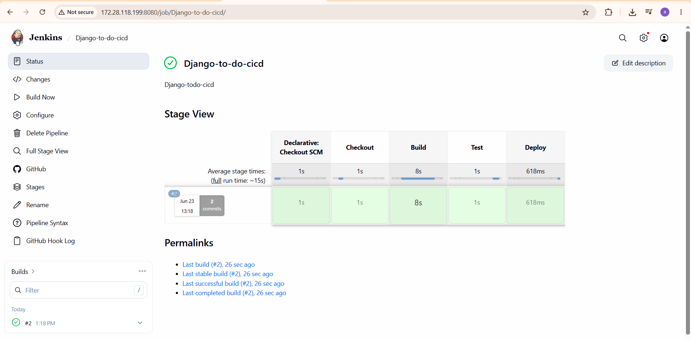

# django-todo
A simple todo app built with Django.

## Application Screenshot


## Jenkins CI/CD Pipeline

This project uses a Jenkins Declarative Pipeline to automate the CI/CD workflow. The pipeline performs the following stages:

- Checkout
- Build Docker Image
- Run Django Tests
- Deploy Docker Container

### Pipeline Screenshot



### Setup

To get this repository, run the following command inside your git enabled terminal

```bash
git clone https://github.com/abhinav150487/django-todo-cicd.git
```
